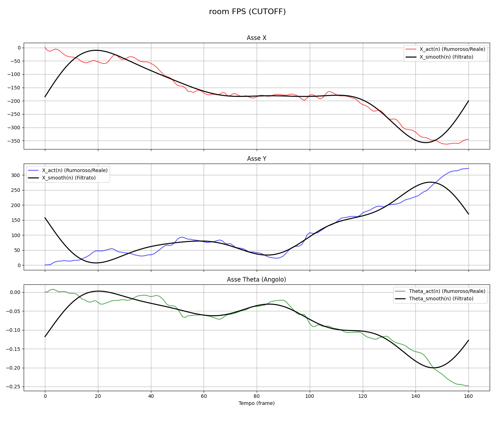
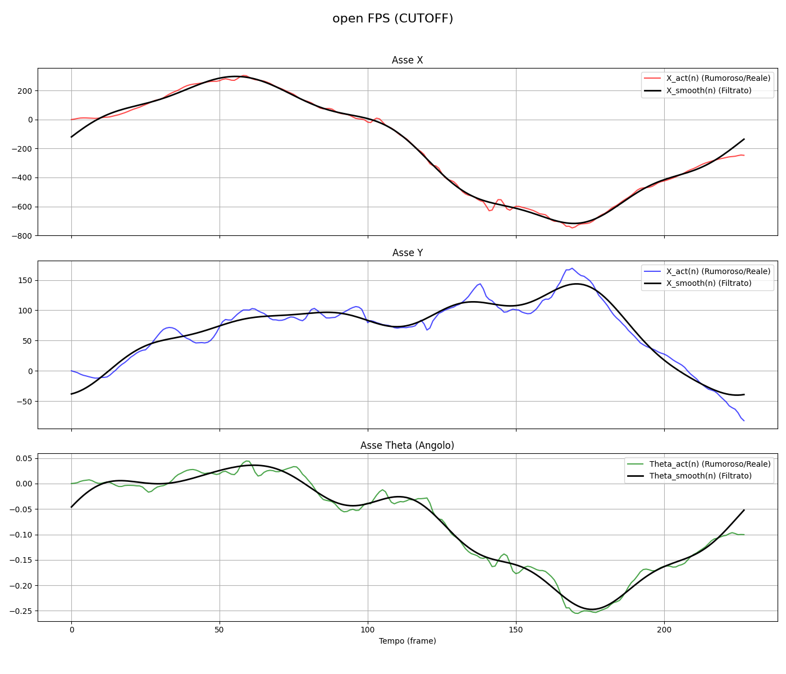
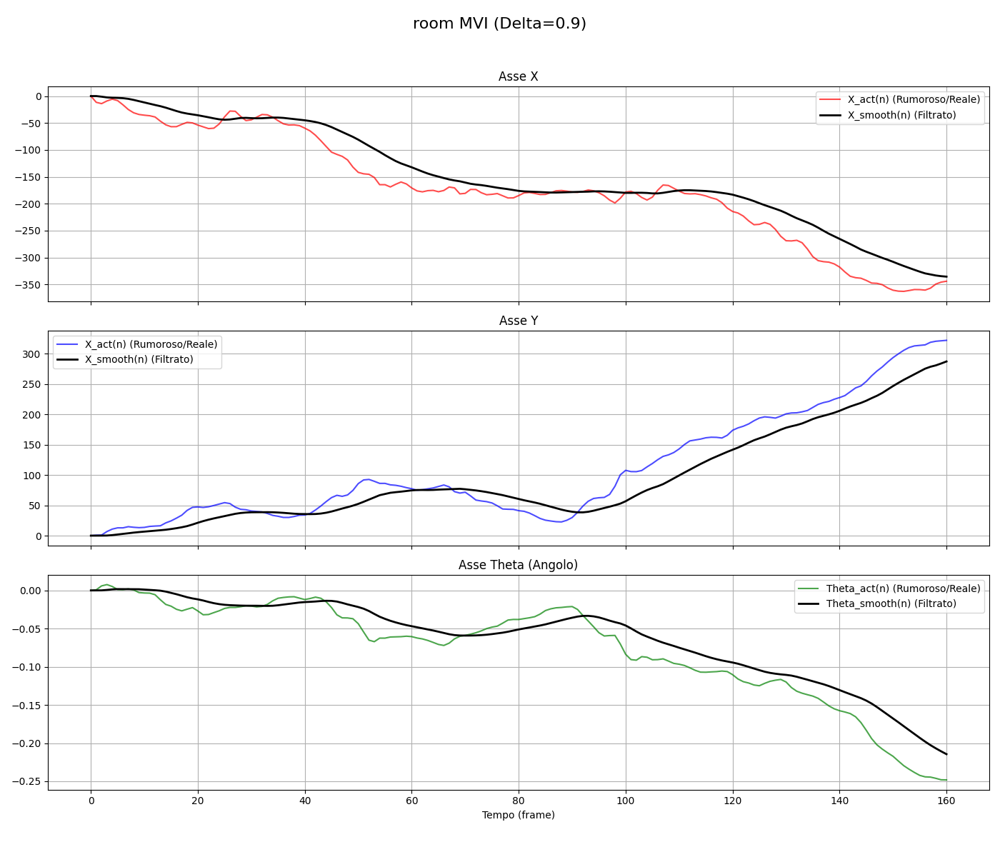
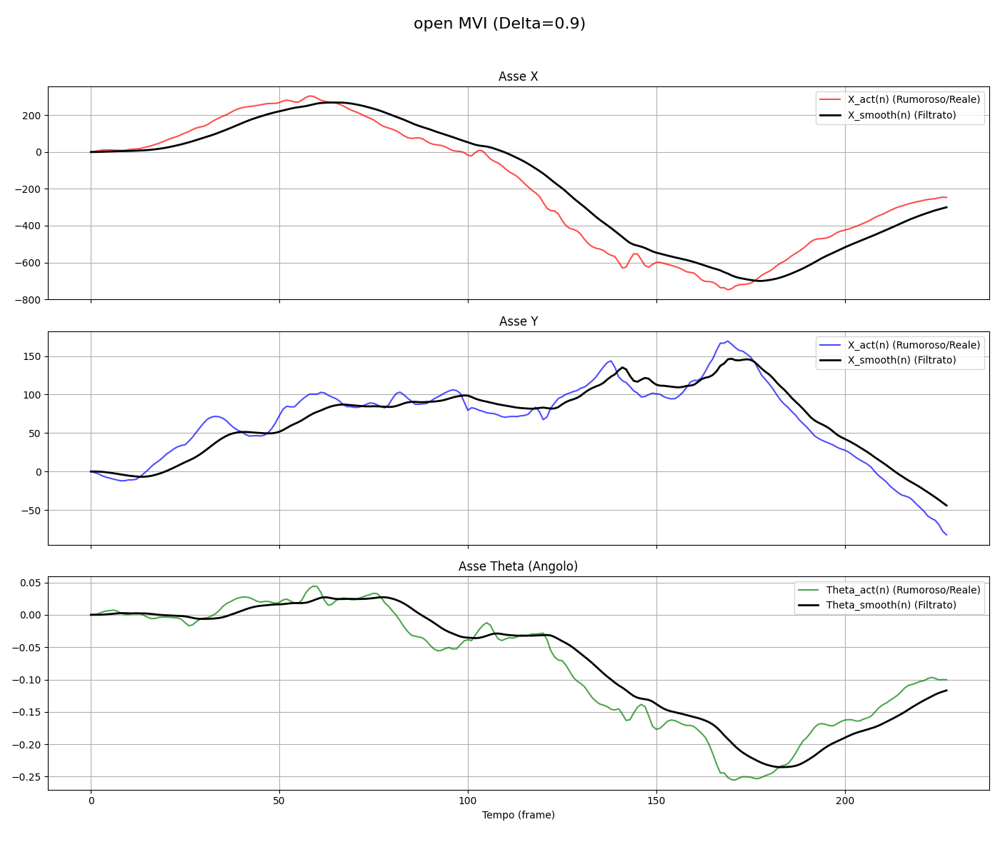
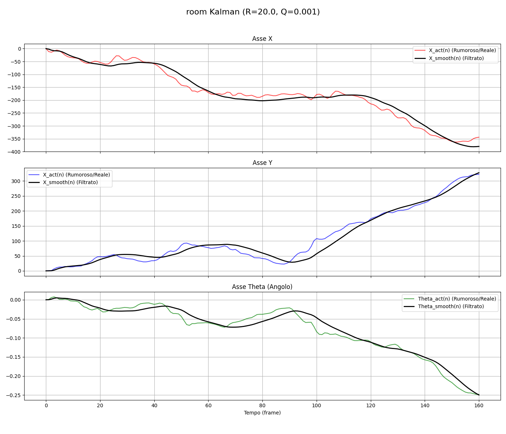
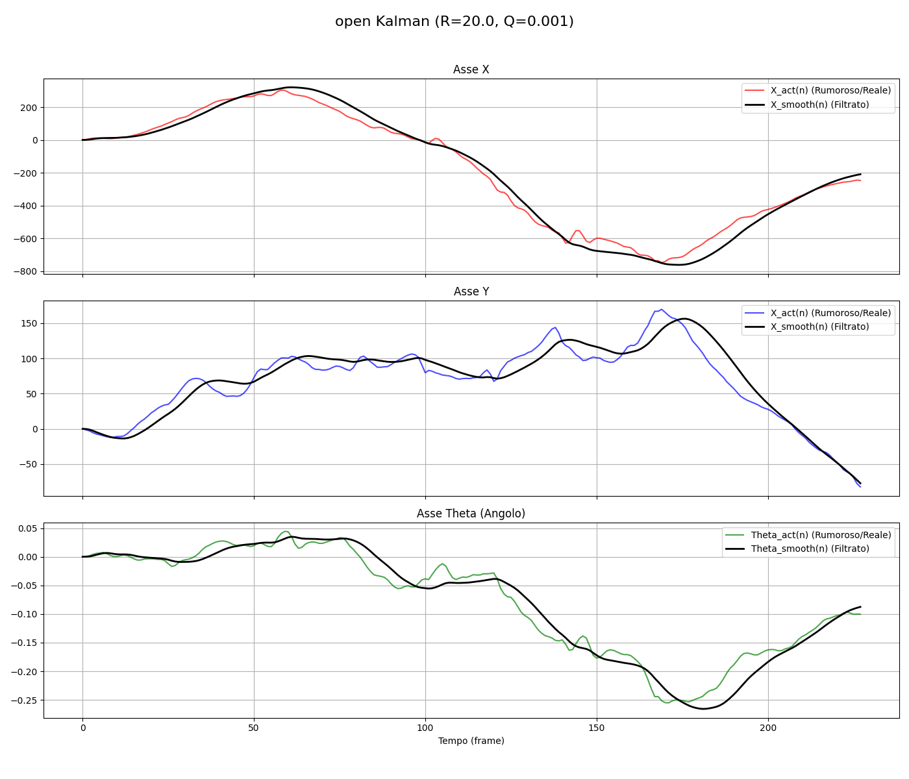

# stabilizers-analysis

## Introduzione
Questo repository contiene implementazioni di vari algoritmi di stabilizzazione video. L'obiettivo è confrontare le prestazioni di diversi metodi di stabilizzazione applicati a un video di una scena immobile con movimento della videocamera.
Verranno utilizzati due video di test: "room.mp4" e "open.mp4", entrambi presenti nella cartella `./inputs/`.

## Struttura del progetto
L'obiettivo di questo progetto è implementare e analizzare comparativamente diversi algoritmi per la stabilizzazione video digitale. Il progetto si articola in tre fasi:

- Fase 1: Stima del Movimento

- Fase 2: Filtraggio del Movimento

- Fase 3: Stabilizzazione del Video (Post-processing)

Ogni fase è implementata con moduli Python separati, come descritto di seguito.

## Fase 1: Stima del Movimento
Codice: `phase1_extract.py`

Questa fase si occupa di stimare la traiettoria del movimento della videocamera `trajectory_X_act(n)` e `vectors_V_act(n)` a partire dal video mosso. 
- `trajectory_X_act(n)`: Accumulo dei movimenti stimati fino al frame n.
- `vectors_V_act(n)`: Vettori di movimento stimati tra frame consecutivi, richiesto per l'applicazione del metodo MVI nella fase 2.

Vengono utilizzati i feature points ottenuti con `cv2.goodFeaturesToTrack` e tracciati con `cv2.calcOpticalFlowPyrLK`. Il video con i feature points tracciati è visualizzabile in `./outputs/phase1/video/`.


## Fase 2: Filtraggio del Movimento
Codice: `phase2_filters.py`

Questa fase mira a ridurre il rumore nella traiettoria stimata `X_act(n)` utilizzando diversi metodi di filtraggio:

- Frame Position Smoothing (FPS)
- Motion Vector Integration (MVI)
- Filtro di Kalman

### Frame Position Smoothing (FPS)
Il FPS applica un filtro di smoothing alla traiettoria `X_act(n)` per ottenere una traiettoria più stabile `X_smooth(n)`. Sono implementati due tipi di filtri:
- Filtro "Gaussiano": Utilizza una funzione gaussiana per attenuare le alte frequenze.
- Filtro "Cutoff": Un filtro passa-basso che elimina completamente le frequenze sopra una certa soglia.

I limiti principali di FPS sono:
- La necessità di conoscere l'intera traiettoria in anticipo (non real-time).
- Il "Ringing" causato dall'assunzione di periodicità nella trasformata di Fourier, mostrato nel grafico sottostante dallo scostamento iniziale e finale della traiettoria filtrata.

#### Grafico Esempio - FPS (Cutoff)
<table>
    <tr>
        <td align="center">room.mp4</td>
        <td align="center">open.mp4</td>
    </tr>
    <tr>
        <td></td>
        <td></td>
    </tr>
</table>

Si nota che il ringing non è presente in open.mp4, in quanto la traiettoria inizia e termina in posizioni simili.

Per mitigare il ringing che porta ad uno zoom eccessivo in fase di deformazione, è possibile applicare un trimming, rimuovendo i primi e gli ultimi N frame (configurabile).

### Motion Vector Integration (MVI)
La MVI calcola la traiettoria stabilizzata `X_smooth(n)` integrando i vettori di movimento `V_act(n)` con un fattore di smorzamento `delta`. Questo metodo è real-time e non richiede trimming. Come mostrato nel grafico sottostante, MVI evita il problema del ringing.

#### Grafico Esempio - MVI
<table>
    <tr>
        <td align="center">room.mp4</td>
        <td align="center">open.mp4</td>
    </tr>
    <tr>
        <td></td>
        <td></td>
    </tr>
</table>

Qui si nota il comportamento negativo di MVI in open.mp4, dove la traiettoria stabilizzata si discosta significativamente da quella originale a causa dell'accumulo di errori nei vettori di movimento stimati. Questo è dovuto alla natura real-time di MVI.

### Filtro di Kalman
Il filtro di Kalman cerca di stimare la traiettoria stabile `X_smooth(n)` considerando il modello di movimento e il rumore delle misurazioni. I parametri `R` e `Q` controllano la fiducia nelle misurazioni e nel modello di movimento, rispettivamente.

#### Grafico Esempio - Kalman
<table>
    <tr>
        <td align="center">room.mp4</td>
        <td align="center">open.mp4</td>
    </tr>
    <tr>
        <td></td>
        <td></td>
    </tr>
</table>  

Il filtro di Kalman presuppone un modello di movimento lineare e gaussiano, che non si adatta perfettamente ai movimenti della camera dovuti alla camminata. Tuttavia, con una corretta scelta dei parametri `R` e `Q`, può comunque fornire buoni risultati di stabilizzazione.

## Fase 3: Stabilizzazione del Video (Post-processing)
Codice: `phase3_stabilize.py`

Questa fase utilizza `safe_dx_corr` e `safe_dy_corr` per trovare il frame "peggiore" in termini di spostamento, e calcola i fattori di zoom necessari per mantenere l'inquadratura all'interno dei bordi del video. Successivamente, applica le trasformazioni ai frame originali per generare il video stabilizzato.
È stato scelto di applicare uno zoom fisso calcolato in base al massimo spostamento corretto, per evitare effetti di cropping indesiderati.

# Risultati

Di seguito sono riportati esempi di output dei video stabilizzati utilizzando i diversi metodi di filtraggio.

## Video Originale - open.mp4
<div align="center">


### Video Stabilizzati

</div>

## Video Originale - room.mp4
<div align="center">


### Video Stabilizzati

</div>


# Come Usare
1. Clona il repository.
2. Installa le dipendenze elencate in `requirements.txt`.
3. Esegui `main.py` con i parametri desiderati:
```python3 main.py path/to/video.mp4 FPS/MVI/Kalman --smoothing_method [-s] gaussian/cutoff (da specificare solo per FPS)```


# Risorse Utili:
- S. Erturk, "Image sequence stabilisation: motion vector integration (MVI) versus frame position smoothing (FPS)," ISPA 2001. Proceedings of the 2nd International Symposium on Image and Signal Processing and Analysis. In conjunction with 23rd International Conference on Information Technology Interfaces

- F. Stanco, D. Allegra, "Video - Parte 4: Stabilizzazione". Risorse Didattiche di Multimedia, Università di Catania.